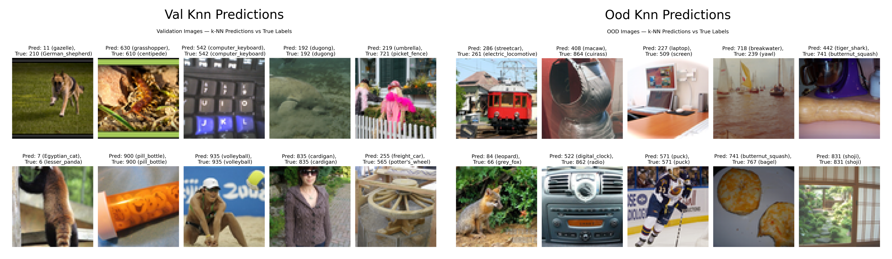

# Report for Graded Assignment 1
> CS-461 Foundation Models and Generative AI

In this assignment, I chose to use the SimCLR model for self-supervised learning. When I compared SimCLR, BYOL, and Barlow Twins on the ImageNet dataset from Exercise Sheet 2 with the default parameters, SimCLR achieved the highest k-NN accuracy (10.72%), outperforming by little BYOL (10.47%) and Barlow Twins (10.22%). This motivated me to continue experimenting with SimCLR for this task.

To improve its performance, I tuned several hyperparameters and optimization choices. 

1. First, I changed the **temperature parameter** τ from 0.5 to 0.1. Google’s SimCLR study [1] showed that τ = 0.1 yields the best performance. To verify this, I tried τ = 0.05, τ = 0.5, and τ = 0.1 in this setup. Consistent with the literature, τ = 0.1 provided the best in-distribution and out-of-distribution results.  

2. I also tested two **optimizers**, Adam and AdamW, and found that AdamW led to better accuracy. This is likely because AdamW properly decouples weight decay from the adaptive learning-rate updates, which improves regularization and generalization. Additionally, I reduced the learning rate from 0.6 to 4e-3. This smaller learning rate stabilized training and allowed AdamW to converge smoothly. With smaller updates, the model was able to gradually minimize the loss and reach a flatter, lower-loss region in the parameter space.

3. Experimentations with the **batch size** were also conducted by running the training with 256, 512, and 1024 samples per batch. The results clearly showed that the accuracy increased as the batch size grew. This behavior is consistent with the theory: larger batches provide more negative examples for contrastive learning, which enriches the training signal and helps the model learn more discriminative representations.

4. A **ResNet18** model was also used. Experiments with larger architectures such as ResNet34 and ResNet50 were conducted, but they showed no improvement. This is likely because the dataset is relatively small, so increasing the model size does not lead to better performance.

5. Finally, we experimented with different numbers of **training epochs**. Starting from 50 epochs, which appeared insufficient, we gradually increased the count to 100, 200, and then 300. This decision was also inspired by insights from the Google study [1]. Although the performance improvements became smaller with more epochs, we still observed incremental gains.

After applying all these changes, the model reached a k-NN accuracy of **38.12%**, nearly **four times higher** than the baseline performance from Exercise Sheet 2 (≈10%). On the out-of-distribution (OOD) dataset, it achieved **24.4%** accuracy. Although lower than the in-distribution score, this value is still well above random chance, showing that the learned representations generalize to unseen classes.

**Figure 1** shows that both training and validation losses decrease steadily across epochs, while the k-NN and linear accuracies increase. The loss drops rapidly during the first 50 epochs and then stabilizes. **Figure 2** presents 10 random samples from both the validation in distribution and out of distribution datasets, displaying their true and predicted labels. For the in distribution 5/10 labels were correctly predicted while for the OOD dataset 2/10. However, even when incorrect, predictions were often semantically close to the correct class (for example, a screen predicted as a laptop or a fox predicted as a leopard). Finally, **Figure 3** presents two t-SNE plots comparing the in distribution and out-of-distribution (OOD) datasets, where each dot represents an image. Both datasets have 200 labels, and 20 were randomly selected and colored to visualize clustering by label. In the validation dataset, samples with the same label form distinct clusters, while in the OOD dataset, similar patterns appear but with more dispersed clusters, likely due to the smaller dataset size.

Overall, these experiments demonstrate that careful tuning of temperature, learning rate, optimizer, epochs and batch size can significantly improve SimCLR’s performance. The final model produces strong, transferable image representations that generalize well beyond the training distribution. The limit here resides in the small dataset size. With bigger datasets and more computing, better performances could be reached.

---

## Figures

---

**Reference**  
[1] [SimCLR: A Simple Framework for Contrastive Learning of Visual Representations (Google Research, ICML 2020)](https://icml.cc/media/icml-2020/Slides/6762.pdf)

*ChatGPT was used to support writing and code formatting*
